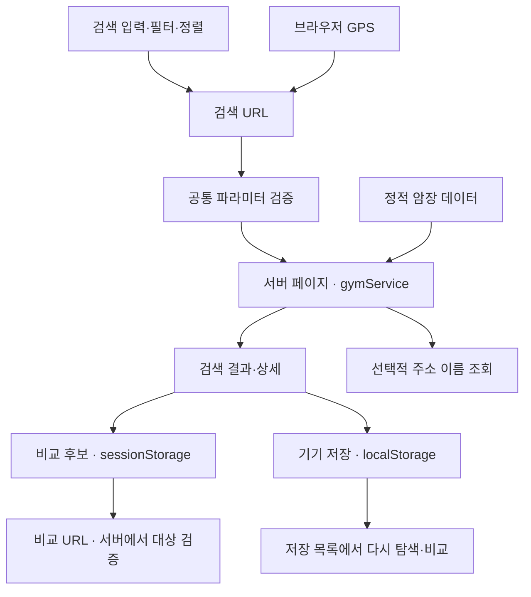

# 🧗 오르리 · ORURI

**방문 조건에 맞는 클라이밍 암장을 찾고, 비교하고, 다시 찾아보는 프론트엔드 프로젝트입니다.**

지역·현재 위치로 후보를 찾은 뒤 가격과 시설을 비교하고, 마음에 드는 암장을 브라우저에 저장할 수 있습니다. 기존 서비스를 Next.js App Router로 재구축하면서 **검색 상태의 일관성, 비동기 요청 경합, 저장 실패 복구, 접근성**에 집중했습니다.

[배포 주소](https://orri-climbing.vercel.app) · [개발 브랜치](https://github.com/dmswl6310/Orri-Climbing/tree/dev) · [자동 검증](https://github.com/dmswl6310/Orri-Climbing/actions/workflows/ci.yml)

> **로그인 없이 전체 흐름을 체험할 수 있는 포트폴리오 데모입니다.**
> 기존 목업 50개와 명확히 표시한 가상 암장 3개를 사용합니다. 암장 정보·사진은 실제 영업 정보가 아니며, 실제 이용자 평점이나 누적 저장 수를 표시하지 않습니다.
> 이 문서는 `dev`의 구현을 기준으로 합니다. 배포 주소의 반영 시점은 다를 수 있습니다.

## 빠르게 체험하기

**검색 → 조건 좁히기 → 후보 비교 → 기기에 저장 → 다시 찾기**

1. 홈의 **가상 암장 3개로 가격·시설 필터 체험하기**를 선택합니다.
2. 일일권 최대 가격 **15,000원**과 **주차** 조건을 적용합니다. 가상 암장 중 조건에 맞는 결과만 남는지 확인합니다.
3. 필터를 초기화한 뒤 암장 **2~3개를 비교에 담고**, 가격·운영 시간·시설을 나란히 확인합니다. 비교 링크도 복사할 수 있습니다.
4. 검색 결과나 상세 화면에서 **이 기기에 저장**을 누릅니다.
5. 상단 **기기 저장**에서 다시 찾아보고, 새로고침·새 탭에서도 목록이 유지되는지 확인합니다.

현재 위치 권한이 없어도 지역명 검색과 비교·저장은 사용할 수 있습니다.

## 주요 기능

| 기능 | 구현 내용 |
| --- | --- |
| 암장 검색 | 지역·이름·주소 검색, 자동완성, 방향키·Enter·Escape 조작, 한글 조합 입력 보호 |
| 방문 조건 | 일일권 예산, 주차, 샤워실, 암벽화 대여, 초보자 체험 강습을 AND 조건으로 적용 |
| 검색 상태 복원 | 조건·정렬·좌표를 URL로 유지, 개별 조건 해제, 필터/전체 초기화, 뒤로 가기 복원 |
| 위치 기반 탐색 | GPS 거리순과 직선거리 표시, 권한 거부·시간 초과 안내, 새 요청과 이전 응답의 경합 처리 |
| 암장 비교 | 최대 3개 선택, 가격·거리·주소·운영 시간·시설·강습·난이도 비교, URL 공유 |
| 기기 저장 | 검색·상세에서 저장/해제, 저장 목록에서 다시 비교, 같은 브라우저 탭 간 변경 반영 |
| 예외와 접근성 | 로딩·오류 재시도·404·빈 결과, 이미지 대체 화면, 입력 검증, 포커스·상태 안내, 모바일 비교표 스크롤 |

기본순은 명시적으로 지정한 **데모 표시 순서**입니다. 실제 인기 순위가 아니며 최신순은 제공하지 않습니다. 기존 `/login` 주소는 검색으로, `/settings` 주소는 기기 저장 목록으로 이동합니다.

## 기술 구성

| 영역 | 사용 기술 |
| --- | --- |
| UI·라우팅 | Next.js 16 · React 19 · App Router |
| 언어·스타일 | TypeScript strict · Tailwind CSS 4 · 로컬 Pretendard |
| 데이터 | 정적 목업 · 선택적 Kakao Local API |
| 브라우저 상태 | URLSearchParams · sessionStorage · localStorage · useSyncExternalStore |
| 테스트 | Vitest · Testing Library · Playwright |
| 검증·배포 | GitHub Actions · Vercel |

실행 환경은 **Node.js 24.x**입니다. 정확한 설치 버전은 [package-lock.json](./package-lock.json)을 기준으로 합니다.

## 설계와 데이터 흐름



서버는 검색·비교 파라미터를 검증하고 목록을 구성합니다. 클라이언트는 입력, 위치 요청, 저장소와 사용자 상호작용을 담당합니다. Kakao 주소 조회가 실패해도 좌표를 이용한 거리 계산은 계속 동작합니다.

### 1. URL을 검색 상태의 기준으로 사용

검색어·조건·정렬·좌표의 해석과 URL 생성을 공통 함수로 모았습니다. 검색어를 바꾸거나 GPS·정렬을 조작할 때도 기존 조건을 유지하며, 중복 파라미터와 잘못된 좌표·가격은 정규화합니다.

- **이유:** 화면에 보이는 조건과 서버가 조회한 결과가 달라지는 문제를 줄이고, 공유·새로고침·뒤로 가기를 지원하기 위해서입니다.
- **관련 코드:** [검색 규칙](./src/utils/search.ts), [목록 서비스](./src/services/gymService.ts), [조건 폼](./src/components/search/SearchChoices.tsx)

### 2. 늦은 GPS 응답이 새 검색을 덮어쓰지 않도록 처리

브라우저 위치 요청에는 직접적인 취소 API가 없으므로, 검색·정렬·이동이 발생하면 진행 중인 요청을 무효화합니다. 뒤늦게 도착한 응답은 화면 이동에 사용하지 않습니다.

- **검증:** 중복 클릭, 권한 거부, 재시도, 요청 간 경합과 뒤로 가기를 훅·브라우저 테스트로 확인합니다.
- **관련 코드:** [위치 검색 훅](./src/hooks/useLocationSearch.ts), [위치 테스트](./tests/location.test.tsx)

### 3. 비교 후보·기기 저장·공유 상태를 분리

| 상태 | 저장 위치 | 역할 |
| --- | --- | --- |
| 검색 조건 | URL | 공유·새로고침·뒤로 가기에서 검색 복원 |
| 비교 후보 | sessionStorage | 현재 탭에서 최대 3개 후보 유지 |
| 기기에 저장한 암장 | localStorage | 같은 사이트·브라우저에서 탭을 닫았다 열어도 목록 유지 |
| 공유 비교 대상 | URL의 암장 ID | 받는 사람의 저장 상태와 무관하게 같은 대상·순서 표시 |

비교 선택과 기기 저장은 별개입니다. 저장을 해제해도 비교 후보는 유지되고, 비교표에서 항목을 제거해도 저장된 후보를 자동 삭제하지 않습니다.

브라우저 저장소는 hydration 이후 읽으며, 서버 렌더링과 클라이언트의 초기 상태를 맞춥니다. 비교 저장소가 차단되면 메모리 선택으로 계속 동작합니다. 기기 저장은 쓰기가 성공한 뒤에만 완료 상태를 표시하고, 실패하면 기존 목록을 유지합니다.

- **관련 코드:** [비교 저장소](./src/utils/comparison.ts), [기기 저장소](./src/utils/saved.ts), [저장 Provider](./src/components/saved/SavedProvider.tsx)

### 4. 미확인 정보와 빈 결과를 그대로 전달

시설은 **가능 / 불가 / 정보 없음**을 구분합니다. 예산은 유효한 일일권의 최저가를 사용하며, 가격·시설이 미등록된 암장은 해당 조건을 만족한 것으로 취급하지 않습니다. 검색 결과가 0개라면 0개로 표시하고 조건 밖 추천을 별도 영역에 둡니다.

- 기존 암장의 가격·초보자 강습 정보를 추정해서 채우지 않았습니다. `demo-1`~`demo-3`에서 가상 조건을 체험할 수 있습니다.
- 이미지 누락·실패·지원하지 않는 주소는 공통 대체 화면으로 처리합니다.
- **관련 코드:** [암장 속성 판정](./src/utils/gymFacts.ts), [이미지 대체 처리](./src/components/common/GymImage.tsx)

## 실행 방법

Node.js 24.x와 npm이 필요합니다. **외부 API 키 없이도 실행할 수 있습니다.**

```bash
git clone https://github.com/dmswl6310/Orri-Climbing.git
cd Orri-Climbing
git switch dev
npm ci
npm run dev
```

[http://localhost:3000](http://localhost:3000)에서 확인합니다.

현재 좌표의 행정동 이름까지 표시하려면 [.env.example](./.env.example)을 `.env.local`로 복사하고 `KAKAO_REST_API_KEY`를 설정합니다.

```bash
# macOS / Linux
cp .env.example .env.local
```

```powershell
# Windows PowerShell
Copy-Item .env.example .env.local
```

이 키는 **서버 전용 선택 변수**입니다. `NEXT_PUBLIC_` 접두사를 붙이지 않습니다. GPS는 localhost 또는 HTTPS 환경에서 브라우저 위치 권한이 필요합니다.

프로덕션 모드로 실행하려면 `npm run build` 후 `npm start`를 실행합니다.

## 테스트와 자동 검증

```bash
npm run lint
npm run typecheck
npm test
npm run build
npx playwright install chromium
npm run test:e2e
```

브라우저 테스트는 빌드된 앱을 3100 포트에서 실행합니다. Windows에서 설치된 Edge를 사용하려면 다음과 같이 실행할 수 있습니다.

```powershell
$env:PLAYWRIGHT_CHANNEL = "msedge"
npm run test:e2e
```

| 검증 범위 | 대표 시나리오 |
| --- | --- |
| 검색 규칙 | AND 필터, 가격 0·상한, 미확인 정보, 잘못된 좌표·반복 파라미터 |
| 입력·접근성 | 자동완성 키보드, 한글 조합, 오류 입력 포커스, 초기화 |
| 비동기·이미지 | GPS 응답 경합, 주소 API 실패, 이미지 오류·주소 교체 |
| 비교 | 중복·최대 3개, 공유 URL, 잘못된 ID, 저장소 차단 |
| 기기 저장 | 쓰기 실패·재시도, 손상 데이터, 새로고침·탭 재개, 탭 간 동기화 |
| 브라우저 통합 | 검색→상세→뒤로 가기, 저장→비교, 모바일 표 스크롤, 320px 화면 |

**2026-10-04, `4fffa68` 기준:** 단위·컴포넌트 테스트 79개와 데스크톱·모바일 브라우저 테스트 34개가 통과했습니다. [해당 CI 실행 결과](https://github.com/dmswl6310/Orri-Climbing/actions/runs/37203738747)

[GitHub Actions](./.github/workflows/ci.yml)는 `dev`·`main` 대상 PR과 push에서 린트 → 타입 검사 → 단위 테스트 → 빌드 → Chromium 브라우저 테스트를 실행합니다. 브라우저 테스트에서는 외부 사진 요청을 의도적으로 실패시켜 대체 화면과 사용자 흐름을 검증합니다.

## 코드 탐색

| 경로 | 역할 |
| --- | --- |
| [src/app](./src/app) | 홈·검색·상세·비교·기기 저장 페이지, 로딩·오류·404 |
| [src/components/search](./src/components/search) | 검색 입력·자동완성·필터·정렬 |
| [src/components/comparison](./src/components/comparison) | 후보 선택·비교 바·공유 |
| [src/components/saved](./src/components/saved) | 기기 저장 버튼·목록·실패 안내 |
| [src/services](./src/services) | 암장 조회·필터링, 서버 전용 주소 조회 |
| [src/utils](./src/utils) | URL 검증·생성, 암장 속성 판정, 브라우저 저장소 |
| [tests](./tests) · [e2e](./e2e) | 단위·컴포넌트·브라우저 회귀 테스트 |

## 현재 범위와 한계

- **데이터:** 목업 기반입니다. 실제 영업 정보 검증, DB, 계정 인증, 서버 저장·기기 간 동기화는 구현 범위에 포함하지 않습니다.
- **기기 저장:** 암장 ID만 보관합니다. 사이트 데이터 삭제·브라우저 초기화·비공개 모드 종료 등에 따라 사라질 수 있으며, 공용 브라우저에서는 다른 사용자에게 보일 수 있습니다.
- **동시 수정:** 다른 탭의 변경을 반영하고 쓰기 직전 최신 목록을 읽지만, 정확히 동시에 발생하는 쓰기를 원자적으로 보장하지는 않습니다.
- **위치:** 거리는 하버사인 공식의 직선거리이며 이동 시간·경로가 아닙니다. 위치가 포함된 비교 링크에는 기준 좌표도 포함되므로 복사 버튼 옆에 안내합니다.
- **규모:** 자동완성은 이름·지역·주소 요약을, 저장 페이지는 53개 암장의 카드 데이터를 전달합니다. 대규모 목록에서는 검색 API·페이지네이션 등 별도 전략이 필요합니다.
- **캐시:** 홈에 1주일 재검증, Kakao 주소 조회에 1시간 재검증·3초 요청 제한을 적용했습니다. 정적 목업 변경은 재배포로 반영합니다.
- **성능:** Lighthouse 점수나 개선율은 아직 측정 결과로 제시하지 않습니다. 기존 서비스와 비교하려면 기준 커밋과 동일한 측정 환경이 필요합니다.

후속 확장은 검증한 실제 데이터와 DB 연결, 계정별 동기화, 데이터 규모별 성능 측정입니다. 현재는 **로그인 없이 검색·비교·저장을 끝까지 체험할 수 있는 흐름**을 구현 범위로 삼았습니다.
